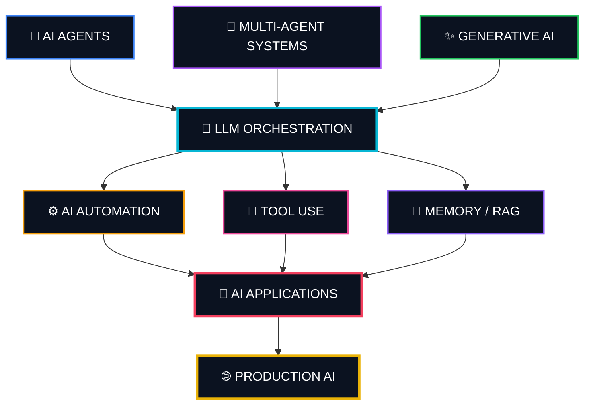

<div align="center">

# 👋 Hi, I'm Lohith Reddy

### 🤖 AI/ML Developer • Agentic AI • Multi-Agent Systems • AI Automation

**Building intelligent systems that can reason, collaborate, automate workflows, and solve real-world problems.**

<br/>

<a href="https://www.linkedin.com/in/lohith-reddy-/">

</a>
<a href="YOUR_PORTFOLIO_URL">

</a>
<a href="mailto:lohith10e.vhs@gmail.com">

</a>

</div>

---

## 🧠 About Me

I'm a **B.Tech Final Year student and AI developer** focused on building practical applications with:

* 🤖 **Agentic AI & AI Agents**
* 🧠 **Multi-Agent Systems**
* ✨ **Generative AI & LLM Applications**
* ⚙️ **AI Workflow Automation**
* 🔗 **LLM Orchestration**
* 🧩 **RAG & Prompt Engineering**
* 🧪 **AI-powered Testing & QA Automation**
* 🌐 **Full-Stack AI Applications**

I enjoy taking an idea from **concept → architecture → implementation → automation → deployment**.

My current goal is to build AI systems that don't simply generate responses, but can **reason about goals, use tools, collaborate with other agents, and take meaningful actions.**

> **Traditional Software → AI-Assisted Software → AI Agents → Autonomous AI Systems**

---

## 🚀 What I'm Building

<div align="center">

|     🤖 Agentic AI    | 🧠 Multi-Agent Systems |   🧪 AI Testing     |
| :------------------:  | :--------------------: | :------------------: |
|       AI Agents       |   Agent Orchestration  |  AI Test Generation  |
|      Planning         |   Specialized Agents   |   E2E Testing        |
|      Reasoning        |   Agent Collaboration  | Autonomous Workflows |


</div>

---

# 🛠️ Tech Stack

### 🤖 AI / Machine Learning

<p>


</p>

### 🧠 AI Frameworks & Orchestration

<p>


</p>

### 💻 Programming

<p>


</p>

### 🌐 Frontend & Backend

<p>


</p>

### ⚙️ Automation & Developer Tools

<p>


</p>

### 🧪 Testing & Quality Engineering

<p>


</p>

---

# 🧩 My AI Engineering Interests

```text
## 🧠 AI Engineering Architecture



> **Intelligence → Orchestration → Action → Applications → Production**

---

# 🌱 Currently Exploring

* 🤖 Production-ready AI Agents
* 🧠 Multi-Agent Architectures
* 🔗 Advanced LLM Orchestration
* ⚙️ Autonomous AI Workflows
* 🧪 AI-powered Software Testing
* 🌐 Full-Stack AI Products
* 🧩 RAG & Tool-Using Agents
* 🚀 Production AI Engineering

---

# 🏆 Programs & Technical Initiatives

* 🤖 AI Hackday 2025
* 🔗 Mastering Multi-Agent AI
* 🚀 IBM SkillsBuild AI Summer Internship
* 🧩 IUCEE Multi-Agent AI Program
* ☁️ Google Vertex AI
* 🏗️ AI / Vibe Coding Hackathons

---

# 👨‍💼 Leadership

### ⚙️ Technical Secretary - KGRCET

Supported Technical Clubs coordination, student initiatives, events, and technology-focused activities.


---

# 📊 GitHub Activity

<div align="center">


</div>

<br/>

<div align="center">


</div>

---

# 💡 My Engineering Philosophy

> **Don't just build AI that generates answers.**
>
> **Build AI that understands a goal, reasons about it, uses tools, collaborates with other agents, and takes meaningful action.**

I'm particularly interested in the transition from:

**Traditional Software → AI-Assisted Software → AI Agents → Autonomous AI Systems**

---

# 🤝 Let's Build Something

I'm interested in collaborating on:

- 🤖 AI Agents
- 🧠 Multi-Agent Systems
- ✨ Generative AI Applications
- ⚙️ AI Automation
- 🧪 AI-powered Testing
- 🚀 AI Startups & Products
- 💡 Hackathons
- 🔬 AI Research & Experimentation

<div align="center">

### 💬 If you're building something interesting with AI, let's connect.

<br/>

<a href="https://www.linkedin.com/in/lohith-reddy-/">

</a>

<a href="mailto:lohith10e.vhs@gmail.com">

</a>

</div>

---

<div align="center">

### ⚡ Fun Fact

**I don't just want to use AI tools.**

**I want to build systems where AI becomes an intelligent worker. 🤖**

<br/>

⭐ **If you find my work interesting, consider starring a repository and following my journey.**

</div>
